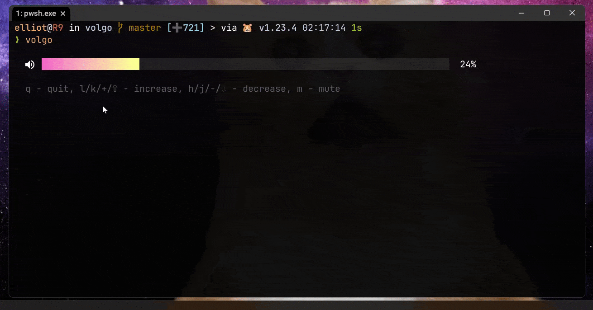

# volgo

[](https://github.com/elliot40404/volgo/actions/workflows/release.yml)
[](https://goreportcard.com/report/github.com/elliot40404/volgo)
[](https://pkg.go.dev/github.com/elliot40404/volgo)




volgo is a simple cross platform cli app that can be used to manage the volume of your system audio.

## Installation

```bash
go install github.com/elliot40404/volgo/cmd/volgo@latest
```

## Usage 

```bash
volgo # to start in interactive mode

volgo help # to see all available commands
```

## Features

- [x] Interactive mode
- [x] Non interactive mode

## Build From Source with alternative engines

```bash
git clone https://github.com/elliot40404/volgo.git
cd volgo
go build -o volgo cmd/volgo/
```

## License

MIT

## Support My Work

<a href="https://ko-fi.com/elliot40404">

</a>
